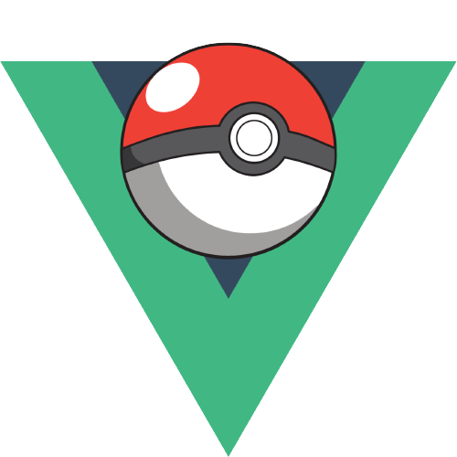
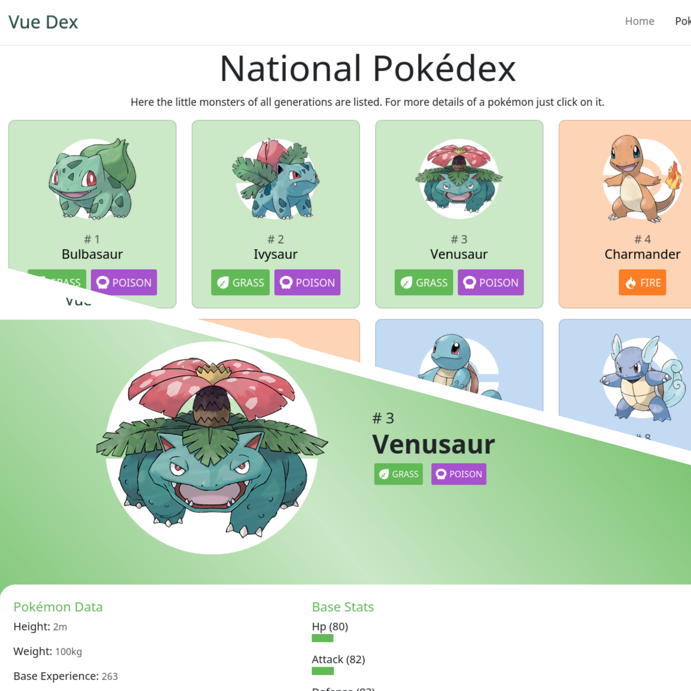

<div style="display: flex !important; flex-direction: column !important; align-items: center !important;">
  
  <h1 style="width: 100% !important; text-align: center !important;">
    Vue Dex
  </h1>
</div>

<p style="text-align: center;">The pokémon database developed in the Vue.js framework.</p>



## Key Features

- Vue.js framework for building the application;
- Creation of routes with vue-router;
- Rest API consumption for data fetching;
- Bootstrap for application stylization;
- Code componentization;

## How To Use

To clone and run this application, you'll need [Git](https://git-scm.com) and [Node.js](https://nodejs.org/en/download/) (which comes with [npm](http://npmjs.com)) installed on your computer. From your command line:

```bash
# Clone this repository
$ git clone https://github.com/fabio-aug/vue-dex.git

# Go into the repository
$ cd vue-dex

# Install dependencies
$ npm install

# Run the app
$ npm run dev

# Or Compile and Minify for Production
$ npm run build
```

> **Note**
> If you don't use Linux and don't have bash, do whatever flow you think is most appropriate.

## Credits

This software uses the following packages and features:

- [Node.js](https://nodejs.org/);
- [Vue.js](https://vuejs.org/);
- [Bootstrap](https://getbootstrap.com/);
- [TypesSvg](https://github.com/duiker101/pokemon-type-svg-icons);
- [PokéApi](https://pokeapi.co/);
- [Vue Router](https://router.vuejs.org/);

## License

MIT
